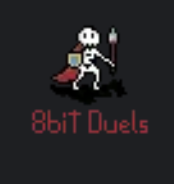

## 8-bit duels

A turn-based multiplayer strategy game written in Rust with the Bevy game engine.
I made a series of devlogs showcasing my gradual progress: check it out [here](https://thousandthstar.github.io/)

#### How to Play 8bit Duels:

* Go to the release tab
* Download the binary for your operating system (Windows, Mac or Linux)
* Download the `assets` folder
* Extract the archive (`zip` or `tar` file) and put it in the same folder as the `assets` folder
* Run the executable extracted from the archive
* In the game, go to the settings and se the server address to `172.105.19.35:1000`

#### Licenses: 

The project is licensed under the MIT Licence, except for the file `Monocraft.otf`, found in the `client/assets` folder.
It is licensed under the terms contained in the `FONT_LICENSE` file.
